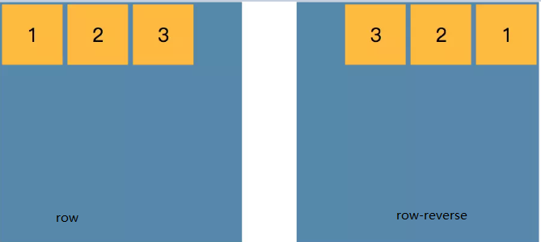
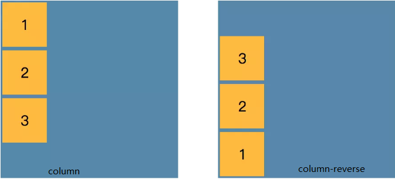

# 浮动
# 负外边距
# #特性
** 在static元素中使用负边距:当一个元素在top/left使用负边距时，它把元素向这个特定的方向拉；但是当你将负边距设置为相对bottom/right时，它并不会把元素向下或右拉，相反，它会把后面的元素往里面拉，从而覆盖自己。
** 使用float的负边距:
   --1.如果是单个浮动元素设置负外边距，和上面一样 
   --2.如果相邻元素都是浮动，那么设置left/right负外边距时，右边的会覆盖左边的。
## 应用：详细参考点击[这里]（https://www.cnblogs.com/jscode/archive/2012/08/28/2660078.html）
** 右侧固定，左侧自适应
** 去除浮动列表最右边的右边距
** 去除列表最后一个li元素的border-bottom
** 多列等高

# flex概述
 * 有容器和项目构成
 
## 容器的属性
  * flex-direction：项目沿着主轴方向的排列方式
  
  ```text
    
    row ：主抽方向从左到右,默认
    row-reverse ：从右到左
    column：纵轴方向从上到下
    column-reverse：纵轴方向从下到上
  ```

  
  
  
  ```text
    默认情况下，项目都是沿着一条主轴先排列，该属性规定了排列不下如何换行,wrap:保持原来的项目宽度，排列不下换行
    
    flex-wrap: nowrap | wrap | wrap-reverse;
```
  * flex-flow
  ```text
    cd
```
  * justify-content
  
  ```text
   定义了项目沿主轴的对齐方式
   
   ustify-content: flex-start | flex-end | center | space-between | space-around;
```
  * align-items
  
  ```text
   定了项目在交叉轴上的对齐方式
   
   align-items: flex-start | flex-end | center | baseline | stretch;
```
  * align-content
  
  ```text
   定义了多根轴线的对齐方式
```

## 项目的属性值
 * order：定义项目的排列顺序。数值越小，排列越靠前
 * flex-grow：定义项目的放大比例，默认为0，即如果存在剩余空间，也不放大
 * flex-shrink：定义了项目的缩小比例，默认为1，即如果空间不足，该项目将缩小
 * flex-basis:定义了在分配多余空间之前，项目占据的主轴空间（main size）
 * flex:是flex-grow, flex-shrink 和 flex-basis的简写，默认值为0 1 auto。后两个属性可选
 * align-self:允许单个项目有与其他项目不一样的对齐方式，可覆盖align-items属性。默认值为auto，表示继承父元素的align-items属性，如果没有父元素，则等同于stretch。